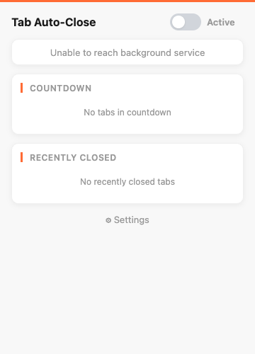
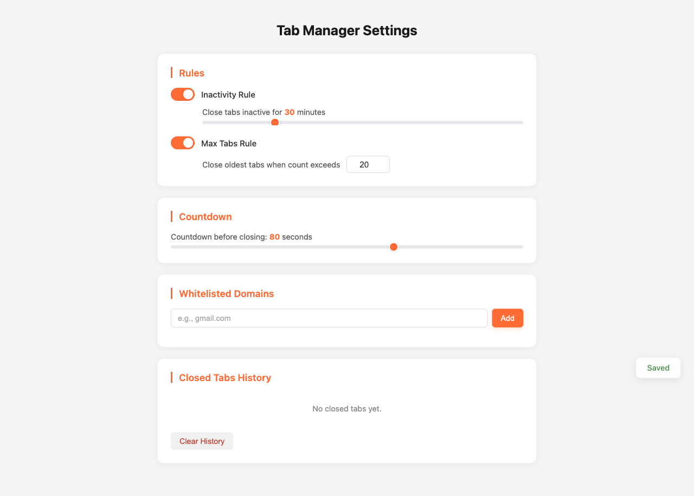

# Auto Tab Closer

A Chrome extension that automatically closes inactive tabs to keep your browser clean and your memory free. Configure rules, whitelist domains, and get a visual countdown before any tab is closed.



## Features

- **Inactivity Rule** — Automatically close tabs that haven't been used for a configurable duration (default: 30 minutes)
- **Max Tabs Rule** — Keep your tab count under a limit (default: 20) by closing the least recently used tabs
- **Visual Countdown** — A red circular timer replaces the tab's favicon for 60 seconds before closing, so you always know what's about to go
- **Cancel by Clicking** — Simply click on a tab in countdown to save it; the favicon restores instantly
- **Whitelist Domains** — Protect important sites (gmail.com, docs.google.com, etc.) from ever being auto-closed
- **Pinned Tab Protection** — Pinned tabs are never closed
- **Closed Tabs History** — Accidentally closed something? Restore any tab closed in the last 2 hours
- **Global Toggle** — Pause and resume auto-closing with a single click

## Screenshots

### Popup
Quick controls — toggle on/off, see stats, manage countdowns, restore closed tabs.


### Settings
Full configuration — rules, countdown duration, domain whitelist, and closed tabs history.



## Installation

### From Source (Developer Mode)

1. **Clone the repo**
   ```bash
   git clone https://github.com/your-username/chrome-last-tabs-close.git
   cd chrome-last-tabs-close
   ```

2. **Install dependencies & build**
   ```bash
   npm install
   npm run build
   ```

3. **Load in Chrome**
   - Open `chrome://extensions`
   - Enable **Developer mode** (top right)
   - Click **Load unpacked**
   - Select the `dist/` folder

## Configuration

All settings are accessible from the extension's options page (click ⚙ Settings in the popup).

| Setting | Default | Range |
|---------|---------|-------|
| Inactivity timeout | 30 min | 5–120 min |
| Max open tabs | 20 | 5–100 |
| Countdown duration | 60 sec | 10–120 sec |
| Whitelisted domains | (none) | Any domain |

Each rule can be independently enabled or disabled. Settings sync across your Chrome devices.

## Tech Stack

- **TypeScript** — Type-safe, zero-framework vanilla TS
- **Manifest V3** — Modern Chrome extension architecture with service workers
- **Vite + CRXJS** — Fast builds with hot reload during development
- **Playwright** — Automated E2E testing with real Chrome extension loading

## Development

```bash
# Start dev server with hot reload
npm run dev

# Build for production
npm run build

# Run tests
npm test

# Run tests with interactive UI
npm run test:ui
```

## Project Structure

```
src/
├── background/
│   ├── service-worker.ts      # Main orchestrator
│   ├── tab-tracker.ts         # Tracks tab access times
│   ├── rules-engine.ts        # Evaluates auto-close rules
│   ├── countdown-manager.ts   # 1-min countdown lifecycle
│   └── history-manager.ts     # Closed tabs history (2hr TTL)
├── content/
│   └── favicon-animator.ts    # Red countdown arc on favicon
├── shared/
│   ├── settings.ts            # Settings read/write + defaults
│   ├── messages.ts            # Message type definitions
│   └── types.ts               # Shared TypeScript types
├── popup/                     # Extension popup UI
└── options/                   # Full settings page
```

## How It Works

1. **Tab Tracker** monitors all tab activity via Chrome's `tabs.onActivated`, `onCreated`, and `onUpdated` events
2. **Rules Engine** runs every 60 seconds via `chrome.alarms`, checking which tabs violate the configured rules
3. **Countdown Manager** starts a 1-minute grace period for tabs marked for closing — injecting a content script that draws a red progress arc on the tab's favicon
4. **Clicking the tab** during countdown cancels it and restores the original favicon
5. **Closed tabs** are saved to history (2-hour retention) and can be restored from the popup

## License

MIT